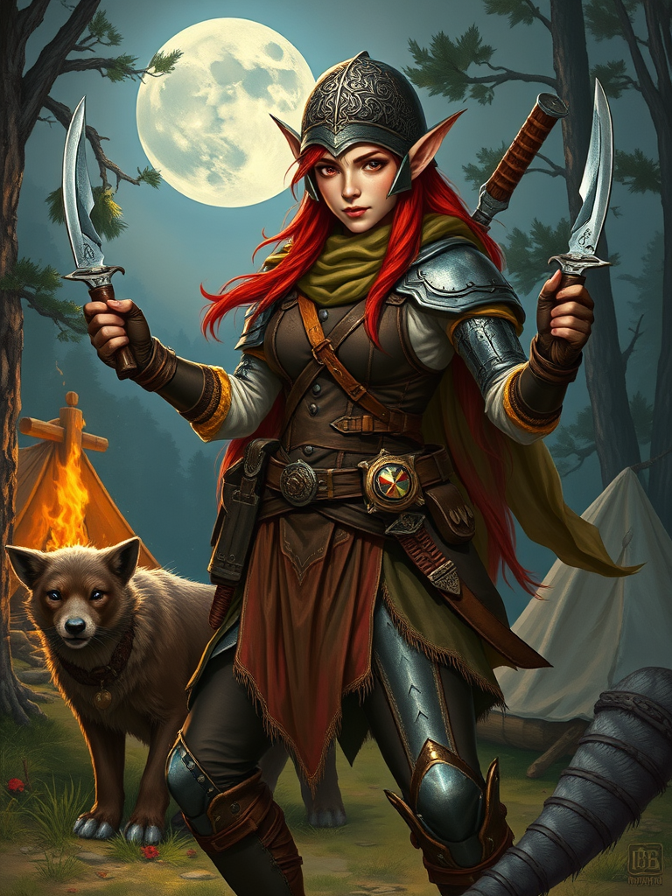

# 🧙‍♂️ DnD Character Creator

DnD Character Creator, masaüstü bir uygulama olarak, Dungeons & Dragons (D&D) evrenine ait karakterleri kolayca oluşturmanıza olanak tanır. GUI destekli bu Python uygulaması, kullanıcıların sınıf, alt sınıf, seviye, ekipman seçerek özelleştirilmiş karakterler oluşturmasını ve hatta bu karakterler için AI destekli görseller üretmesini sağlar.

## ✨ Özellikler

- 🔘 Kullanıcı dostu arayüz (Tkinter ile)
- ⚔️ Fighter, Ranger, Sorcerer gibi ana sınıf seçimi
- 🧬 Alt sınıf ve seviye seçimi (ör. Arcane Archer, Wild Magic vs.)
- 🛡️ Zırh ve silah seçimi
- 💪 Karakter gücünü dinamik olarak hesaplama
- 🖼️ AI ile karakterinize özel görsel üretme (Flux destekli)
- 📄 Prompt kaydetme ve özelleştirme desteği

## 📸 Ekran Görüntüsü

| Karakter Oluşturma | AI Destekli Görsel |
|--------------------|--------------------|
|  |  |

## 🧠 Kullanılan Teknolojiler

- **Python**
- **Tkinter** – GUI için
- **Decorator Pattern** – Dinamik karakter bileşimi
- **Flux / Foocus** – AI görsel üretimi için (gerekli konfigürasyon yapılmalı)
- **Pillow** – Görsel işleme
- **Requests** – API iletişimi

## 🚀 Kurulum

```bash
git clone https://github.com/AhmeTpz/DnD-Character-Creator.git
cd DnD-Character-Creator
pip install -r requirements.txt
python dnd_character_gui.py
